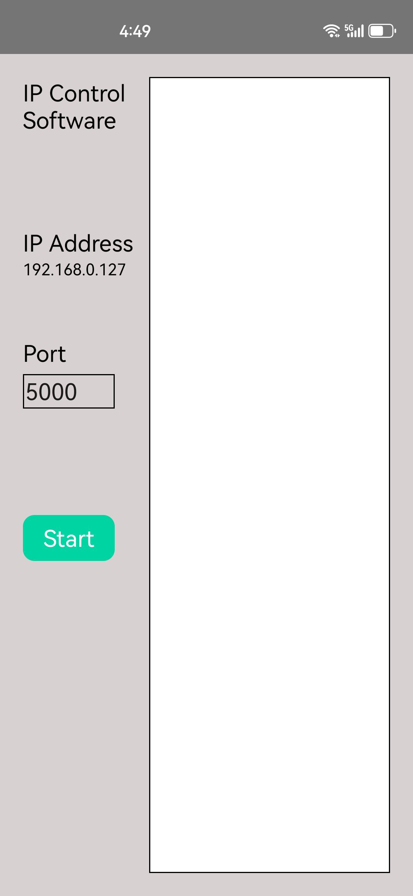
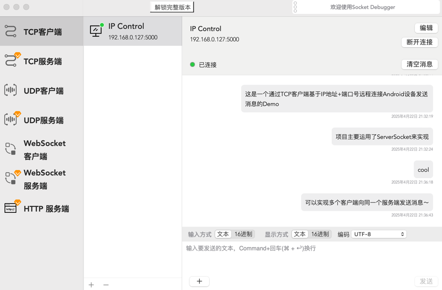
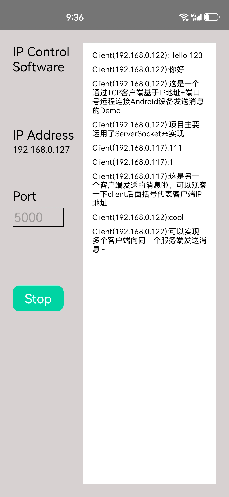

# IPConnect
An Android LAN communication project based on ServerSocket. The client side(any devices as tcp client) connects to the Android side through the IP address and port number.

# Feature display
1. The left column contains the server IP address and port number information
2. You can click the Start button to start the Socket service

3. Any device connected to the same LAN as the server can communicate with the server by using TCP client tools.

4. The server will also receive the client's message
5. A server can be connected by multiple clients at the same time, and each client can be distinguished by IP address

# Technical points used
- ServerSocket
- Get the wired/wireless network IP address
- TCP / IP
- RecyclerView
- MVC

# Demo Apk
[IPConnect Demo Apk](readme_res/IPConnect.apk)

# Project source code address
https://github.com/HumorousRR/IPConnect